<div align="center">


# 知芽 Zhiya

面向小学至高中学生的个性化 AI 学习搭子

让 AI 先认识学生，再用适合他的方式讲解编程与人工智能。

[](LICENSE)

[参与贡献](CONTRIBUTING.md) · [本地开发](docs/development.md) · [官网与版本发布](docs/releasing.md)

</div>

## 认识知芽

知芽希望成为陪伴学生长期学习的 AI 搭子。它不只回答眼前的问题，还会通过自然对话了解学生的年级、知识基础、兴趣和学习偏好，并根据后续表现持续调整讲解方式与学习内容。

学生只需说出想学什么，知芽便可以一边交流，一边组织图文课件，把一次提问逐步展开成适合当前学生的课堂。

## 学习体验

| 先认识学生 | 动态组织课堂 | 记住学习情况 |
| --- | --- | --- |
| 通过轻量对话了解基础、兴趣与学习偏好，无需填写冗长表单。 | 教学 Agent 负责讲解和节奏，课件 Agent 同时逐页生成内容，第一页准备好即可开始学习。 | 保存学生档案、课程和课堂状态，让后续交流建立在已经发生的学习之上。 |

知芽围绕一个持续循环工作：

> 了解学生 → 组织教学 → 观察反馈 → 更新认识 → 调整下一步学习

课堂右侧可切换「课堂展示」与「文档」，侧栏默认收起。课堂展示支持图文课件、动画、题目和编程练习；课程建立后，会从这些内容自动形成可下载的 PPTX 和 Word（DOCX）文档。文档可供老师备课，也可供学生阅读、练习。

在对话中提出视频主题、BV 号或作者线索，知芽可以读取 B 站搜索网页的第一页，根据标题、作者、时长和近似播放量选择视频，并在右侧嵌入播放器。暂不支持搜索翻页，不读取视频简介或精确发布时间。无需绑定 B 站账号；搜索受限或页面无法解析时会如实反馈，不自动重试或排队等待。播放由用户控制，翻页或离开课堂展示区后停止，返回时从头加载。视频不下载到平台，也不嵌入导出的 Office 文件。

在产物侧栏选中一页或一节，通过对话要求修改，课堂源内容的修改会同步到下载文件。文字、图片、题目、编程题说明与初始代码会收录到 PPT，交互图示按初始画面和各个动画步骤展开为静态页面，保留图形、连线、数值变化和重点标记；播放控件及学生作答保留在课堂。文档还包含课程目标与专门生成的教程、备课说明等补充材料，聊天记录保留在对话区。也可以在课堂材料中导入不超过 24 MB 的 PPT／PPTX，重新排版后继续修改。导入会提取文字和嵌入图片，原模板及复杂 Office 对象的处理范围会在产物中说明；下载文件包含图片，可离线打开。

## 系统架构

知识库资料及已完成的文本、视觉 Embedding 独立发布在 [Hugging Face：LanternCX/zhiya-knowledge](https://huggingface.co/datasets/LanternCX/zhiya-knowledge)。配置基础设施后执行 `bash scripts/import-knowledge.sh`，审核操作说明并确认，即可完成下载、校验及 PostgreSQL／RustFS 导入，无需重新生成向量；配置与接入步骤见 [知识库说明](apps/knowledge/README.md)。

主／子 Agent 统一在服务端运行；Go 分别向客户端和 Agent 提供 API，共用业务与持久化能力。客户端断开连接不取消生成，重新进入后恢复已保存的内容与运行状态。



图中合并展示服务间通信，不单独绘制响应回路。Go 向 Pi 下发执行指令，Pi 通过内部 API 调用工具、回传生成事件；客户端 API 使用用户身份，内部 API 使用服务身份与本次执行授权，两者共用业务层。

Go 按接入层、应用层和基础设施层组织。

## 本地运行

准备 Node.js 22.19+、npm、Go 1.26+ 和 Docker，然后在仓库根目录执行：

```sh
npm install
npm run dev:services
```

再分别启动服务端和浏览器客户端：

```sh
npm run dev:server
npm run dev
```

打开 <http://127.0.0.1:1420> 使用知芽；本地验证邮件可在 <http://127.0.0.1:8025> 查看。模型连接、桌面端运行、配置方式和测试命令见[开发指南](docs/development.md)。

## 参与贡献

欢迎通过 Issue 和 Pull Request 一起完善知芽。开始前请阅读[贡献指南](CONTRIBUTING.md)，了解项目的协作方式、人工审核要求和提交流程；项目目标、范围和验收场景见[产品需求 Issue #3](https://github.com/LanternCX/zhiya/issues/3)。

## License

知芽采用 [GNU Affero General Public License v3.0](LICENSE) 开源。
